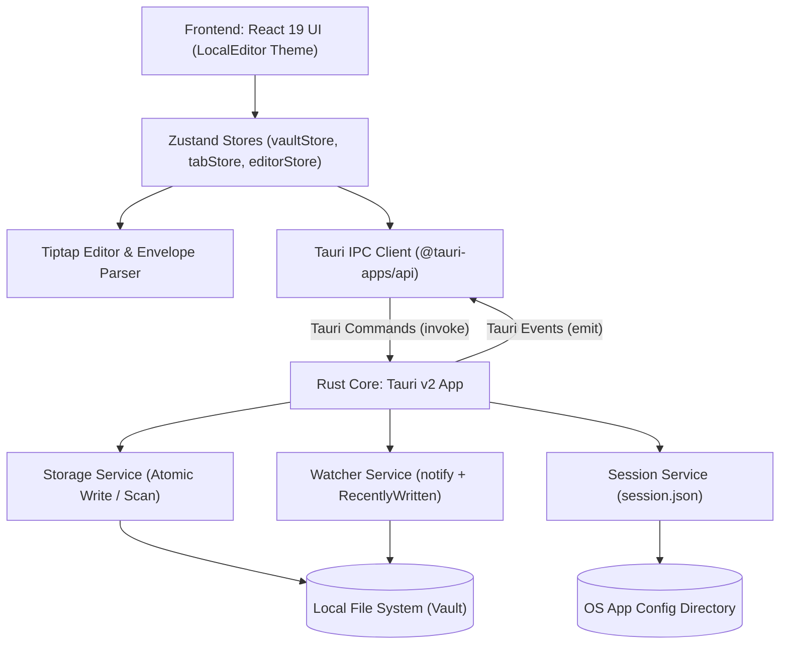

# Architecture Spine — snipnote

## Design Paradigm

Hexagonal Architecture (Ports & Adapters) separated by a strict asynchronous Tauri IPC bridge:
- **Core Domain (Frontend)**: `NoteDocument` (Envelope: `rawFrontmatter` + `body`), `VaultTree`, `TabSession`. Pure TypeScript types and models.
- **Adapters — UI Presentation (Frontend)**: Tiptap Editor, LocalEditor-style Chrome (`Sidebar`, `TabBar`, `StatusBar`, `CommandPalette`, `ConflictBanner`), Zustand Stores (`useVaultStore`, `useTabStore`, `useEditorStore`).
- **Ports (Tauri IPC Boundary)**: Strictly typed IPC invocations (`open_vault`, `read_file`, `write_file`, `create_note`, `get_session`, `save_session`) and event streams (`vault:file-changed`, `vault:tree-changed`).
- **Adapters — Infrastructure (Rust Backend)**:
  - `StorageAdapter`: Atomic disk operations (write to temp file + `fs::rename`), recursive directory indexing for `.md` notes.
  - `WatcherAdapter`: Native OS file monitoring via `notify` with in-memory `RecentlyWritten` cache for echo suppression.
  - `SessionAdapter`: App state and window geometry persistence in `$APP_CONFIG_DIR/session.json`.



## Invariants & Rules

### AD-1 — Rust Backend Disk Authority & Native Watching [ADOPTED]

- **Binds:** FR-1, FR-2, FR-7, FR-8, storage layer
- **Prevents:** Partial writes on application crash, corrupted files, uncoordinated race conditions with Claude Code, and missing OS-level file modification events.
- **Rule:** All filesystem read, write, directory scan, and watch operations MUST execute within the Rust backend. The frontend WebView MUST NOT import `@tauri-apps/plugin-fs` directly or perform direct disk I/O. All file writes MUST use atomic replacement: write to a temporary file in `.snipnote/tmp` (or OS temp), flush to disk, and atomically rename over the target path.

### AD-2 — Note Document Envelope Model [ADOPTED]

- **Binds:** FR-6, FR-7, editor layer
- **Prevents:** ProseMirror/Tiptap DOM nodes mangling, reordering, or stripping YAML frontmatter and file metadata during parsing or serialization.
- **Rule:** Every note loaded from disk MUST be parsed using the Envelope pattern into `rawFrontmatter: string | null` and `body: string`. Tiptap MUST receive and edit ONLY the `body`. On save, the raw frontmatter block MUST be prepended verbatim byte-for-byte to the serialized markdown output.

### AD-3 — Rust Echo Suppression for File Watcher [ADOPTED]

- **Binds:** FR-8, watcher layer
- **Prevents:** Self-inflicted reload loops or false "File changed on disk" banners when snipnote saves its own active buffer.
- **Rule:** The Rust backend MUST maintain a thread-safe `RecentlyWritten` cache (mapping file paths to `mtime` and hash with a 2-second TTL). Whenever `write_file` executes, the resulting path and metadata are registered. When the `notify` watcher fires a file event, Rust checks the cache: if matched, the event is swallowed; if mismatched, Rust emits `vault:file-changed { path, mtime }` to the frontend.

### AD-4 — External Change Resolution Policy [ADOPTED]

- **Binds:** FR-8, editor layer, tab layer
- **Prevents:** Data loss of unsaved human edits and disruptive blocking modals during background AI writes.
- **Rule:** When the frontend receives `vault:file-changed`:
  - If the target file is currently open and clean (`dirty === false`), the frontend MUST automatically reload the latest content from disk while preserving cursor and scroll offset.
  - If the target file is currently open and dirty (`dirty === true`), the frontend MUST NOT auto-reload; it MUST display an inline non-blocking banner under the Tab Bar: `File changed on disk — [Reload] [Keep mine]`.
  - If the target file is not open in an active tab, the frontend MUST update the vault tree silently.

### AD-5 — Isolated Zustand Stores & Mermaid NodeView [ADOPTED]

- **Binds:** FR-2, FR-4, FR-5, FR-6, FR-10, UI performance
- **Prevents:** Keystroke-level document stat re-renders lagging the sidebar or tabs; monolithic state coupling; editor stutter.
- **Rule:** Frontend state MUST be partitioned into isolated Zustand stores (`useVaultStore`, `useTabStore`, `useEditorStore`). Live document statistics (words, characters, paragraphs) MUST be calculated and rendered via isolated subscribers without re-rendering parent tree components. Code blocks with language `mermaid` MUST use a custom React NodeView that toggles between raw markdown text editing and dynamic client-side SVG rendering via `mermaid.js`.

### AD-6 — Rust-Managed Session and Window Geometry [ADOPTED]

- **Binds:** FR-1, FR-11, windowing layer
- **Prevents:** Visual layout flickering, empty-vault flashes, or lost window geometry across app restarts.
- **Rule:** App session state (`last_vault_path`, `open_tabs`, `active_tab`, `window_size`, `window_position`) MUST be persisted in `$APP_CONFIG_DIR/session.json` by Rust. Rust MUST restore window geometry during the `tauri::Builder::setup` lifecycle hook before displaying the window, and supply validated initial session data to the frontend on startup.

### AD-7 — Write Debouncing and Flush Policy [ADOPTED]

- **Binds:** FR-7, editor layer
- **Prevents:** Disk I/O thrashing on rapid typing while ensuring Claude Code reads fresh content within 500ms; prevents keystroke drops during in-flight saves.
- **Rule:** Editor keystroke updates MUST be debounced at 500ms of inactivity before triggering an atomic disk write. The frontend MUST execute an immediate synchronous flush to Rust on tab change, note blur, window blur, and before window close. To prevent dropping keystrokes typed during an in-flight async save, the `dirty` state MUST be cleared if and only if the current editor buffer matches the exact snapshot that was dispatched to disk.

### AD-8 — Draft-Until-Content Note Creation (was Disk-First) [ADOPTED 2026-09-03]

- **Binds:** FR-9, vault layer, editor layer, tab layer
- **Prevents:** Vault pollution with empty `Untitled.md` files when user presses `+`/`⌘N` without typing; desynchronization between draft tabs and disk.
- **Rule:** Clicking `+`/`⌘N` in the Tab Bar MUST create a virtual draft tab `{path: baseVault/Untitled.md, title, isNew:true}` via `useTabStore.selectNote(...,{isNew:true})` with `editor.setContent("")` and `isDirty:false`, without invoking Rust `create_note` nor touching disk. The draft MUST remain in-memory (italic title + hollow dot) until `hasContent = body.trim()||frontmatter.trim() >0`. First autosave (500ms debounce) or flush (blur/tab switch/close) with `hasContent` MUST invoke `write_file` → atomic write → `markTabSaved(false)` → `loadVault` to show file in tree. Empty draft closed or window blurred with no content MUST do nothing on disk. `openTabs` persisted in `session.json` MUST exclude `isNew` drafts; `sanitize_session` filters to existing files.

### AD-9 — Vibrant Window Material via EffectsBuilder Only [ADOPTED 2026-09-03; UPDATED 2026-09-08]

- **Binds:** FR-11, window layer, design tokens
- **Prevents:** Non-native window chrome, heavy custom blur JS, applying macOS Overlay/Sidebar APIs on Windows.
- **Rule:** Window MUST be `transparent:true` with `html/body/#root` transparent. Material MUST be applied via EffectsBuilder only (no `window-vibrancy` crate), **platform-split**:
  - **macOS:** `macOSPrivateApi:true` + `macos-private-api` feature; `TitleBarStyle::Overlay` + empty title; `EffectsBuilder::new().effects([Effect::Sidebar]).state(Active).radius(12.0)` → `set_effects`.
  - **Windows:** native decorations + title `"snipnote"`; `EffectsBuilder::new().effects([Effect::Mica]).state(Active)` → `set_effects` (errors ignored on older Windows).
  - **Linux / unsupported:** native decorations; opaque CSS fills.
  Do **not** pass `[Sidebar, Mica]` as a single combined list. Window `1280×720` `min 1100×600`. CSS translucent fills sit over material; Reduce Transparency forces opaque.

### AD-10 — Light/Dark/System Theme + Settings Tab [ADOPTED 2026-09-03; UPDATED 2026-09-08]

- **Binds:** FR-12, FR-13, design tokens
- **Prevents:** Theme flicker, modal Settings fighting the editor metaphor, hard-coded Mac shortcut glyphs on Windows.
- **Rule:** Theme state MUST live in `src/stores/useThemeStore.ts` (`theme: light|dark|system` + `effectiveTheme` + tint hue/amount + `bgOpacity`, `localStorage`, `html[data-theme]` + `matchMedia` when `system`). Settings MUST be `src/components/settings/SettingsView.tsx` rendered as an editor **tab** (virtual path), opened via global `keydown` `⌘,`/`Ctrl+,` or gear controls, closed via `{mod},` toggle or close tab. Shortcut labels MUST use `src/utils/platform.ts` `modShortcut` / `modKeyLabel`. Appearance includes Hue, Intensity, Reduce Transparency; System includes autostart + updater controls.

### AD-11 — Local-First Network Policy & Tauri Security Isolation [ADOPTED; UPDATED 2026-09-08]

- **Binds:** FR-11, FR-14, security, NFR
- **Prevents:** Remote code execution or data leakage of local vault files; silent telemetry.
- **Rule:** The application MUST remain local-first: no telemetry, no cloud sync, vault files never leave disk. **Exception (FR-14):** `tauri-plugin-updater` MAY perform outbound HTTPS to configured updater endpoints (GitHub Releases `latest.json` + artifact URLs) for version check and signed download/install. Tauri CSP MUST disallow external scripts (`script-src`/`default-src 'self'` as configured). No other outbound network in v1.

### AD-12 — Auto-Update Client [ADOPTED 2026-09-08]

- **Binds:** FR-14, distribution
- **Prevents:** Stuck installs; unsigned update payloads; noisy checks every launch.
- **Rule:** Updater pubkey + endpoints MUST live in `tauri.conf.json`. Frontend MUST use `src/lib/updater.ts`: startup check ~4s after reveal when Automatic Updates enabled (default on), throttled ≤12h; Settings Check always immediate; install only after user confirm → `downloadAndInstall` → `relaunch`. Release CI MUST produce `.sig` with `TAURI_SIGNING_PRIVATE_KEY`; drafts MUST be published before `/releases/latest` works.

### AD-13 — Dual Presentation: Float (v1) + Full Shell (v2 flag) [ADOPTED 2026-09-08]

- **Binds:** FR-F1..FR-F6, window layer
- **Prevents:** Deleting the full editor; forcing vault IDE on every launch; duplicating TipTap stacks.
- **Rule:**
  - Window labels: `float` (default UX), `main` (full vault shell).
  - Boot MUST register system tray / menu bar; default UX shows `float` on demand (hotkey/tray), not `main`.
  - Global shortcut toggles `float` visibility. [ASSUMPTION: `CmdOrCtrl+Shift+Space`]
  - Feature flag `snipnote-full-editor` (localStorage and/or env) gates showing/creating `main` with the existing React `App` shell.
  - Both presentations MUST share `EditorSurface`, `SettingsView`, Zustand stores, Rust storage/watcher/updater.
  - Closing `float` MUST hide to tray by default; Quit exits the process. [ASSUMPTION]
  - Do not apply full-shell Overlay TabBar traffic-light insets to the compact float blindly — float chrome is specified in UX.

## Consistency Conventions

| Concern | Convention |
| --- | --- |
| Note Identity | Canonical absolute OS path is the sole unique identifier for note entities across IPC, tabs, and editor stores (POSIX on macOS/Linux; drive-letter / UNC on Windows). |
| Note File Naming | Note filenames match the title on disk (e.g. `Tech Stack Decisions.md`); new notes default to `Untitled.md`, `Untitled 1.md`. |
| IPC Tree Contract | Directory hierarchy across IPC MUST conform to `interface VaultNode { path: string; name: string; isDirectory: boolean; children?: VaultNode[]; }`. |
| Frontend Code Style | PascalCase for React components (`FileTree.tsx`), camelCase for hooks and stores (`useVaultStore.ts`), kebab-case for CSS (`app.css`). |
| Rust Code Style | snake_case for modules (`storage.rs`, `watcher.rs`) and commands (`open_vault`, `write_file`). |
| IPC Event Naming | Colon-delimited kebab-case (`vault:file-changed`, `vault:tree-changed`). |
| Path Normalization | Paths exchanged across IPC MUST be absolute and OS-native; frontend helpers in `src/utils/paths.ts` / `src/lib/path.ts` handle `/` and `\`. |
| Metadata Preservation | `rawFrontmatter` is the exact substring between leading `---\n` and closing `\n---`; null if absent. |
| Error Representation | Errors across IPC MUST conform to `{ code: string, message: string }`. |
| State Mutation | Any keystroke or note edit sets `dirty: true` until atomic save completes for that snapshot. |

## Stack

| Name | Version |
| --- | --- |
| Rust (toolchain) | 2021 edition (stable 1.84+) |
| Tauri | 2.2.0 |
| React | 19.1.0 |
| TypeScript | 5.8.3 |
| Vite | 7.0.4 |
| Tiptap Core & StarterKit | 2.11.5 |
| @tiptap/markdown | 3.30.5 |
| Zustand | 5.0.15 |
| notify (Rust crate) | 8.2.0 |
| serde & serde_json | 1.0.217 |
| mermaid | 11.4.0 |

## Structural Seed

```text
snipnote/
  src-tauri/
    src/
      lib.rs                # Commands, menu, window chrome cfg(macos|windows), EffectsBuilder split, plugins
      main.rs               # Entry point (windows_subsystem)
      storage.rs            # Atomic save, scan (dot-folders + hide empty)
      watcher.rs            # notify + RecentlyWritten
      session.rs            # session.json + openTabs
      boot.rs               # Warm-boot cache
    Cargo.toml              # tauri macos-private-api; updater/autostart plugins
    tauri.conf.json         # transparent, updater pubkey/endpoints, CSP, createUpdaterArtifacts
  src/
    components/
      welcome/
        WelcomeGate.tsx     # Brand-first drop zone + Choose Folder
      sidebar/
        Sidebar.tsx         # Left pane + gear Settings + vault switch
        FileTree.tsx        # SVG icons + filtered tree
      editor/
        EditorSurface.tsx   # Tiptap + FindBar + SettingsView host
        TabBar.tsx          # Multi-tabs + welcomeMode + platform chrome
        HomeView.tsx        # Vault overview when no note
        StatusBar.tsx
        ConflictBanner.tsx
      palette/
        CommandPalette.tsx
      settings/
        SettingsView.tsx    # Tab: Appearance / Writing / System / Diagnostics
      rightPanel/           # Built but hidden
    lib/
      updater.ts            # Startup + manual update check/install
      specialTabs.ts        # Settings virtual tab
    utils/
      platform.ts           # PLATFORM, modShortcut
      paths.ts              # Absolute path helpers (/ and \)
    stores/
      useVaultStore.ts
      useTabStore.ts
      useEditorStore.ts
      useThemeStore.ts      # Theme + tint + bgOpacity
    App.tsx                 # Shell + WelcomeGate + startup updater
```

## Capability → Architecture Map

| Capability / Area | Lives in | Governed by |
| --- | --- | --- |
| FR-1: Open local Vault + WelcomeGate | `WelcomeGate.tsx`, `useVaultStore.ts`, `storage.rs` | AD-1, AD-6 |
| FR-2: Render File Tree (filtered + icons) | `FileTree.tsx`, `useVaultStore.ts`, `storage.rs` | AD-1, AD-8 |
| FR-3: Active highlight & Library + Settings gear | `Sidebar.tsx`, `useTabStore.ts` | AD-5, AD-10 |
| FR-4: Search via `{mod}P` | `CommandPalette.tsx`, `useVaultStore.ts` | AD-5 |
| FR-5: File Tree & Multi-Tabs | `TabBar.tsx`, `useTabStore.ts` | AD-5, AD-8 |
| FR-6: Live Markdown & Mermaid + Draft | `EditorSurface.tsx`, TipTap NodeViews | AD-2, AD-5, AD-8 |
| FR-7: Raw Markdown Round-Trip | `envelope.ts`, `storage.rs`, `useEditorStore.ts` | AD-1, AD-2, AD-7, AD-8 |
| FR-8: Watcher & Conflict Banner | `watcher.rs`, `ConflictBanner.tsx` | AD-1, AD-3, AD-4 |
| FR-9: Multi-Tab + Draft-Until-Content | `TabBar.tsx`, `useTabStore.ts`, `App.tsx` | AD-5, AD-8 |
| FR-10: Live Document Statistics | `StatusBar.tsx`, `stats.ts` | AD-5 |
| FR-11: Platform chrome & material | `lib.rs` window builder + effects cfg | AD-6, AD-9 |
| FR-12: Theme + tint | `useThemeStore.ts`, `App.css`, `SettingsView.tsx` | AD-10 |
| FR-13: Settings tab `{mod},` | `SettingsView.tsx`, `specialTabs.ts`, `App.tsx` | AD-10 |
| FR-14: Auto-update & Launch at Login | `lib/updater.ts`, `SettingsView.tsx`, `tauri-plugin-updater`/`autostart` | AD-11, AD-12 |
| Right Panel (hidden) | `src/components/rightPanel/*` | Deferred |

## Deferred (with stubs built but hidden)

| Item | Reason for Deferral / Current State |
| --- | --- |
| Canvas & Whiteboarding (Excalidraw) | Stub built; full Excalidraw deferred to v3. |
| Embedded Terminal & PTY Host | Stub built; PTY deferred to v4. |
| In-App Browser | Stub built; CSP/opener hardening deferred. |
| Floating Window Capture Panel | Deferred to v5. |
| Cloud Sync & User Accounts | v1 local-first; updater HTTPS is the only intentional outbound. |
| Full-Text Search & Indexing | Filename search meets v1 goals. |
| Three-Way Git Merge Conflicts | Banner lets human decide. |
| Linux packaged + QA | Opaque fallback only; not a v1 release target. |
| Mobile and Web Distributions | Out of scope. |
