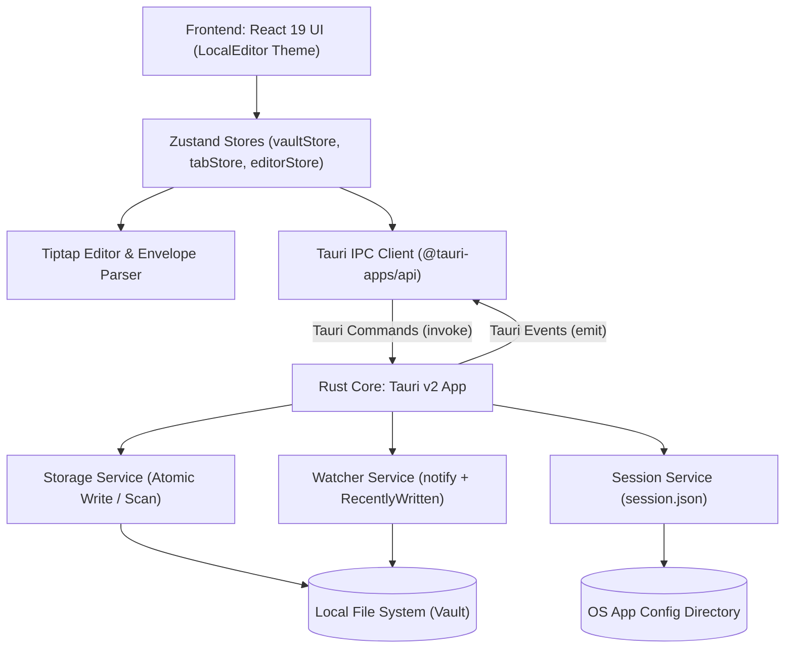

# Architecture Spine — snipnote

## Design Paradigm

Hexagonal Architecture (Ports & Adapters) separated by a strict asynchronous Tauri IPC bridge:
- **Core Domain (Frontend)**: `NoteDocument` (Envelope: `rawFrontmatter` + `body`), `VaultTree`, `TabSession`. Pure TypeScript types and models.
- **Adapters — UI Presentation (Frontend)**: Tiptap Editor, LocalEditor-style Chrome (`Sidebar`, `TabBar`, `StatusBar`, `CommandPalette`, `ConflictBanner`), Zustand Stores (`useVaultStore`, `useTabStore`, `useEditorStore`).
- **Ports (Tauri IPC Boundary)**: Strictly typed IPC invocations (`open_vault`, `read_file`, `write_file`, `create_note`, `get_session`, `save_session`) and event streams (`vault:file-changed`, `vault:tree-changed`).
- **Adapters — Infrastructure (Rust Backend)**:
  - `StorageAdapter`: Atomic disk operations (write to temp file + `fs::rename`), recursive directory indexing for `.md` notes.
  - `WatcherAdapter`: Native OS file monitoring via `notify` with in-memory `RecentlyWritten` cache for echo suppression.
  - `SessionAdapter`: App state and window geometry persistence in `$APP_CONFIG_DIR/session.json`.



## Invariants & Rules

### AD-1 — Rust Backend Disk Authority & Native Watching [ADOPTED]

- **Binds:** FR-1, FR-2, FR-7, FR-8, storage layer
- **Prevents:** Partial writes on application crash, corrupted files, uncoordinated race conditions with Claude Code, and missing OS-level file modification events.
- **Rule:** All filesystem read, write, directory scan, and watch operations MUST execute within the Rust backend. The frontend WebView MUST NOT import `@tauri-apps/plugin-fs` directly or perform direct disk I/O. All file writes MUST use atomic replacement: write to a temporary file in `.snipnote/tmp` (or OS temp), flush to disk, and atomically rename over the target path.

### AD-2 — Note Document Envelope Model [ADOPTED]

- **Binds:** FR-6, FR-7, editor layer
- **Prevents:** ProseMirror/Tiptap DOM nodes mangling, reordering, or stripping YAML frontmatter and file metadata during parsing or serialization.
- **Rule:** Every note loaded from disk MUST be parsed using the Envelope pattern into `rawFrontmatter: string | null` and `body: string`. Tiptap MUST receive and edit ONLY the `body`. On save, the raw frontmatter block MUST be prepended verbatim byte-for-byte to the serialized markdown output.

### AD-3 — Rust Echo Suppression for File Watcher [ADOPTED]

- **Binds:** FR-8, watcher layer
- **Prevents:** Self-inflicted reload loops or false "File changed on disk" banners when snipnote saves its own active buffer.
- **Rule:** The Rust backend MUST maintain a thread-safe `RecentlyWritten` cache (mapping file paths to `mtime` and hash with a 2-second TTL). Whenever `write_file` executes, the resulting path and metadata are registered. When the `notify` watcher fires a file event, Rust checks the cache: if matched, the event is swallowed; if mismatched, Rust emits `vault:file-changed { path, mtime }` to the frontend.

### AD-4 — External Change Resolution Policy [ADOPTED]

- **Binds:** FR-8, editor layer, tab layer
- **Prevents:** Data loss of unsaved human edits and disruptive blocking modals during background AI writes.
- **Rule:** When the frontend receives `vault:file-changed`:
  - If the target file is currently open and clean (`dirty === false`), the frontend MUST automatically reload the latest content from disk while preserving cursor and scroll offset.
  - If the target file is currently open and dirty (`dirty === true`), the frontend MUST NOT auto-reload; it MUST display an inline non-blocking banner under the Tab Bar: `File changed on disk — [Reload] [Keep mine]`.
  - If the target file is not open in an active tab, the frontend MUST update the vault tree silently.

### AD-5 — Isolated Zustand Stores & Mermaid NodeView [ADOPTED]

- **Binds:** FR-2, FR-4, FR-5, FR-6, FR-10, UI performance
- **Prevents:** Keystroke-level document stat re-renders lagging the sidebar or tabs; monolithic state coupling; editor stutter.
- **Rule:** Frontend state MUST be partitioned into isolated Zustand stores (`useVaultStore`, `useTabStore`, `useEditorStore`). Live document statistics (words, characters, paragraphs) MUST be calculated and rendered via isolated subscribers without re-rendering parent tree components. Code blocks with language `mermaid` MUST use a custom React NodeView that toggles between raw markdown text editing and dynamic client-side SVG rendering via `mermaid.js`.

### AD-6 — Rust-Managed Session and Window Geometry [ADOPTED]

- **Binds:** FR-1, FR-11, windowing layer
- **Prevents:** Visual layout flickering, empty-vault flashes, or lost window geometry across app restarts.
- **Rule:** App session state (`last_vault_path`, `open_tabs`, `active_tab`, `window_size`, `window_position`) MUST be persisted in `$APP_CONFIG_DIR/session.json` by Rust. Rust MUST restore window geometry during the `tauri::Builder::setup` lifecycle hook before displaying the window, and supply validated initial session data to the frontend on startup.

### AD-7 — Write Debouncing and Flush Policy [ADOPTED]

- **Binds:** FR-7, editor layer
- **Prevents:** Disk I/O thrashing on rapid typing while ensuring Claude Code reads fresh content within 500ms; prevents keystroke drops during in-flight saves.
- **Rule:** Editor keystroke updates MUST be debounced at 500ms of inactivity before triggering an atomic disk write. The frontend MUST execute an immediate synchronous flush to Rust on tab change, note blur, window blur, and before window close. To prevent dropping keystrokes typed during an in-flight async save, the `dirty` state MUST be cleared if and only if the current editor buffer matches the exact snapshot that was dispatched to disk.

### AD-8 — Disk-First Note Creation Semantics [ADOPTED]

- **Binds:** FR-9, vault layer
- **Prevents:** Desynchronization between UI tabs and disk where external agents fail to detect newly created notes.
- **Rule:** Clicking `+` in the Tab Bar MUST immediately invoke Rust to create `Untitled.md` (or incremented counter `Untitled 1.md`) on disk in the selected folder (or vault root), immediately append it to the vault tree, and set it as the active tab.

### AD-9 — Strict Local-Only Network & Tauri Security Isolation [ADOPTED]

- **Binds:** FR-11, security, NFR
- **Prevents:** Remote code execution or data leakage of local vault files.
- **Rule:** The application MUST operate strictly local-only with no outbound network requests. Tauri Content Security Policy (`csp`) MUST be strictly configured to disallow external scripts (`script-src 'self'`). No remote telemetry or cloud sync calls are permitted in v1.

## Consistency Conventions

| Concern | Convention |
| --- | --- |
| Note Identity | Canonical absolute POSIX path is the sole unique identifier for note entities across IPC, tabs, and editor stores. |
| Note File Naming | Note filenames match the title on disk (e.g. `Tech Stack Decisions.md`); new notes default to `Untitled.md`, `Untitled 1.md`. |
| IPC Tree Contract | Directory hierarchy across IPC MUST conform to `interface VaultNode { path: string; name: string; isDirectory: boolean; children?: VaultNode[]; }`. |
| Frontend Code Style | PascalCase for React components (`FileTree.tsx`), camelCase for hooks and stores (`useVaultStore.ts`), kebab-case for CSS (`app.css`). |
| Rust Code Style | snake_case for modules (`storage.rs`, `watcher.rs`) and commands (`open_vault`, `write_file`). |
| IPC Event Naming | Colon-delimited kebab-case (`vault:file-changed`, `vault:tree-changed`). |
| Path Normalization | All file paths exchanged across the IPC bridge MUST be canonicalized absolute POSIX paths. |
| Metadata Preservation | `rawFrontmatter` is the exact substring between leading `---\n` and closing `\n---`; null if absent. |
| Error Representation | Errors across IPC MUST conform to `{ code: string, message: string }`. |
| State Mutation | Any keystroke or note edit sets `dirty: true` until atomic save completes for that snapshot. |

## Stack

| Name | Version |
| --- | --- |
| Rust (toolchain) | 2021 edition (stable 1.84+) |
| Tauri | 2.2.0 |
| React | 19.1.0 |
| TypeScript | 5.8.3 |
| Vite | 7.0.4 |
| Tiptap Core & StarterKit | 2.11.5 |
| @tiptap/markdown | 3.30.5 |
| Zustand | 5.0.15 |
| notify (Rust crate) | 8.2.0 |
| serde & serde_json | 1.0.217 |
| mermaid | 11.4.0 |

## Structural Seed

```text
snipnote/
  src-tauri/
    src/
      lib.rs                # Tauri command registration & app builder
      main.rs               # Entry point
      storage.rs            # Atomic save, tempfile handling, file reading, directory scan
      watcher.rs            # notify watcher thread & RecentlyWritten echo suppression cache
      session.rs            # session.json load/save & window geometry setup
    Cargo.toml
    tauri.conf.json         # Window definitions, permissions, CSP
  src/
    components/
      sidebar/
        Sidebar.tsx         # Left pane shell (260px)
        FileTree.tsx        # Recursive directory tree
        LibraryFooter.tsx   # Vault switcher & info
      editor/
        EditorSurface.tsx   # Tiptap wrapper & centered 760px canvas
        TabBar.tsx          # History arrows, active note name, '+' button
        StatusBar.tsx       # Live word, character, and paragraph counters
        ConflictBanner.tsx  # Non-blocking external change banner
      palette/
        CommandPalette.tsx  # ⌘P filename quick-switcher
    hooks/
      useTauriEvents.ts     # Listeners for vault:file-changed & vault:tree-changed
    stores/
      useVaultStore.ts      # Active vault path, tree hierarchy, file index
      useTabStore.ts        # Open tabs, active tab path, history stack
      useEditorStore.ts     # Document envelope, dirty status, save debouncer
    utils/
      envelope.ts           # Frontmatter extraction & reattachment
      stats.ts              # Word, character, and paragraph counters
    App.tsx                 # Two-pane layout orchestration
    main.tsx                # React root mount
    index.html
```

## Capability → Architecture Map

| Capability / Area | Lives in | Governed by |
| --- | --- | --- |
| FR-1: Open local Vault | `src-tauri/src/storage.rs`, `useVaultStore.ts` | AD-1, AD-6 |
| FR-2: Render File Tree 1:1 | `components/sidebar/FileTree.tsx`, `useVaultStore.ts` | AD-1, AD-8 |
| FR-3: Active File Highlight & Library | `components/sidebar/Sidebar.tsx`, `useTabStore.ts` | AD-5 |
| FR-4: Search via ⌘P (filename) | `components/palette/CommandPalette.tsx`, `useVaultStore.ts` | AD-5 |
| FR-5: Navigate via File Tree & Tabs | `components/editor/TabBar.tsx`, `useTabStore.ts` | AD-5 |
| FR-6: Live Markdown & Mermaid | `components/editor/EditorSurface.tsx`, Tiptap NodeViews | AD-2, AD-5 |
| FR-7: Raw Markdown Round-Trip | `utils/envelope.ts`, `src-tauri/src/storage.rs` | AD-1, AD-2, AD-7 |
| FR-8: File Watcher & Conflict Banner | `src-tauri/src/watcher.rs`, `ConflictBanner.tsx` | AD-1, AD-3, AD-4 |
| FR-9: Tab Lifecycle & `+` Note | `components/editor/TabBar.tsx`, `src-tauri/src/storage.rs` | AD-5, AD-8 |
| FR-10: Live Document Statistics | `components/editor/StatusBar.tsx`, `utils/stats.ts` | AD-5 |
| FR-11: Native Window & Persistence | `src-tauri/src/session.rs`, `tauri.conf.json` | AD-6, AD-9 |

## Deferred

| Item | Reason for Deferral |
| --- | --- |
| Canvas & Whiteboarding (Excalidraw) | Major scope expansion; deferred to v3 to keep v1 focused on text spec reviews. |
| Embedded Terminal & PTY Host | Terminal emulation complexity; Claude lives in user's Ghostty/iTerm beside snipnote (v4). |
| Floating Window Capture Panel | Competes with Mote; requires multi-window sync complexity (deferred to v5). |
| Cloud Sync & User Accounts | v1 is strictly local-first and single-user. File abstraction remains ready for sync layer. |
| Full-Text Search & Indexing | Filename search via ⌘P meets v1 performance goals (<100ms for 500 notes). Inverted index deferred to v2. |
| Three-Way Git Merge Conflicts | Automated merge logic risks corrupting agent-written specs; v1 banner lets human decide cleanly. |
| Mobile and Web Distributions | Requires custom filesystem bridges; v1 prioritizes macOS/desktop developer workflows. |
